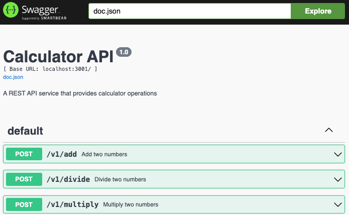

# Backend Service

A REST API service written in Go that provides calculator.

## Configuration

Environment variables:

| Variable              | Description                      | Default |
| --------------------- | -------------------------------- | ------- |
| `PORT`                | Port to listen on                | 3001    |
| `ALLOW_CORS`          | Enable CORS headers              | false   |
| `ENABLE_SWAGGER`      | Enable Swagger UI                | false   |
| `ARTIFICIAL_DELAY_MS` | Max random delay in ms (0=off)   | 0       |

## Requirements

- Go 1.24+
- Make

Hint: Use [mise](https://mise.jdx.dev/getting-started.html) to resolve
development tools: `mise install`

## Development

Key make targets: `make build`, `make test`, `make run`. Run `make help` for all.

Before submitting changes:

```bash
make pre-submit
```

This target fixes issues, builds the service and generates test code coverage
report.

## Running Locally

```bash
make run
```

This make target sets `ENABLE_SWAGGER=true` and thus exposes the API Swagger
documentation at http://localhost:3001/swagger/index.html



## API Examples

The backend exposes REST endpoints at `/v1/*`. Examples:

```bash
# Addition
curl -X POST http://localhost:3001/v1/add -d '{"a":5,"b":3}'
# {"result":"8"}

# Division
curl -X POST http://localhost:3001/v1/divide -d '{"a":10,"b":2}'
# {"result":"5"}

# Square Root
curl -X POST http://localhost:3001/v1/sqrt -d '{"a":16}'
# {"result":"4"}
```

## Coverage

Make sure unittests coverage the happy path and corner cases. Aim for at least
90% coverage. To open code codeverage report in browser, run:

```bash
make open-coverage
```
