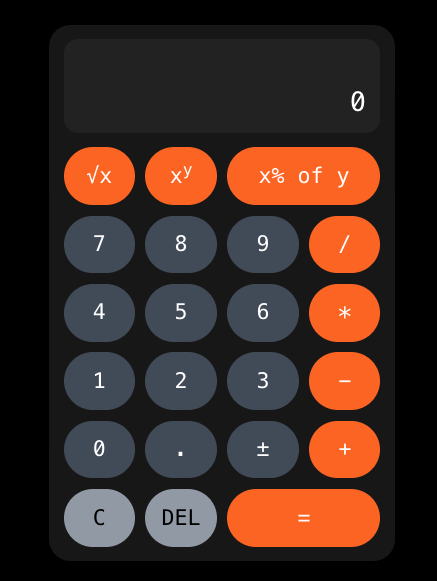

# Frontend

A Next.js application that serves the calculator UI and proxies API requests to the backend.



## Configuration

Environment variables:

| Variable                    | Description              | Default                    |
| --------------------------- | ------------------------ | -------------------------- |
| `PORT`                      | Port to listen on        | 3000                       |
| `CALCULATOR_REST_API_V1_URL`| Calc v1 API URL          | http://localhost:3001/v1   |

## Requirements

- Node.js 20+
- pnpm

Hint: Use [mise](https://mise.jdx.dev/getting-started.html) to resolve
development tools: `mise install`

## Development

Key pnpm scripts: `pnpm build`, `pnpm test`, `pnpm dev`. Run `pnpm run` for all.

Before submitting changes:

```bash
pnpm pre-submit
```

This installs dependencies, fixes issues, builds the application and generates
test coverage report.

## Running Locally

```bash
pnpm dev
```

This starts the development server at http://localhost:3000

Make sure the backend is running at http://localhost:3001 for API calls to work.

## Coverage

Make sure unit tests cover the happy path and corner cases. To open the code
coverage report in browser, run:

```bash
pnpm test:coverage:open
```

## Architecture

The frontend acts as a proxy between the browser and the Go backend:

```
Browser -> Next.js (:3000) -> Go Backend (:3001)
```

API calls from the browser go to `/api/*` which are proxied to the backend at
`CALCULATOR_REST_API_V1_URL`.

## Design

The Calculator UI implements a state machine (`CalculatorState` class) that processes
instructions (keystrokes) and updates internal state:
- **State:** `display`, `operand`, `operator`, `resetDisplay`, `error`, `processing`
- **Instructions:** digits (`0-9.`), operators (`+-*/^%`), and commands (`c`lear,
  `d`elete, `s`qrt, `t`oggle sign, `=`)
- Transitions occur on each instruction, with async API calls for calculations.

The state machine calls the backend API directly. A better implementation would use an
interface to decouple from the backend and simplify testing (though mocking was easy).
